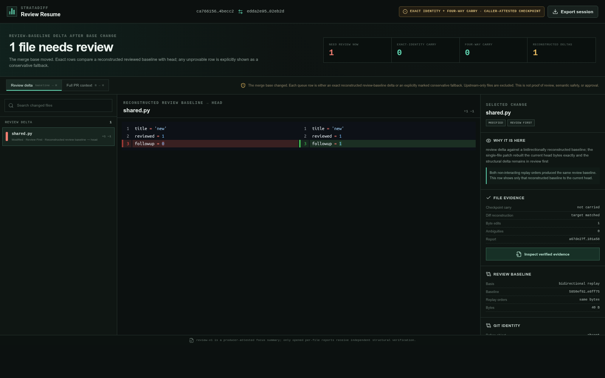
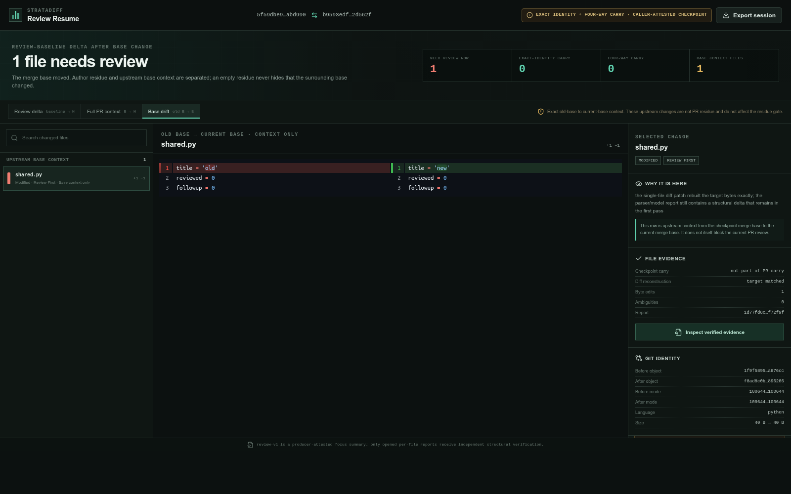
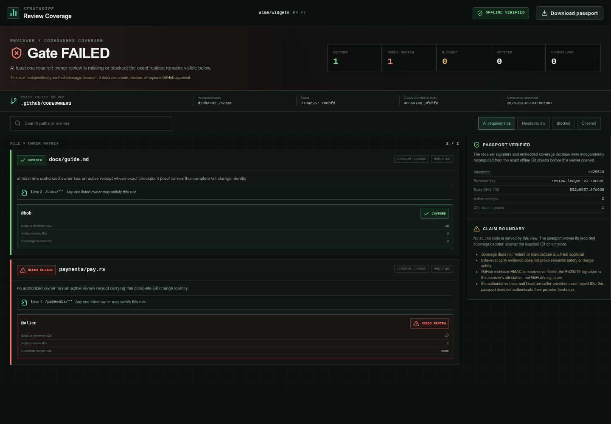

# StrataDiff

**A `gh doctor` for stuck pull requests: identify GitHub's exact evaluation candidate, inspect its
required signals and producers, and show the next evidence-gathering action behind “policy
prohibits this merge.”**

StrataDiff starts as a read-only **PR Flight Recorder and required-check doctor**, then grows into a
verifiable merge-proof control plane for GitHub. It does not replace
Copilot, CodeRabbit, Graphite AI, a policy bot, CI, or a human reviewer. It captures their observable
evidence as versioned, content-addressed snapshots, binds each snapshot to exact PR-head inputs,
evaluates one versioned policy, and publishes a dedicated GitHub App Check for the actual final
candidate—including a merge queue's synthetic `merge_group` SHA.

```text
reviewers + CI -> versioned evidence snapshots -> policy for PR head -> merge-group proof -> App-bound Check
```

The former primary pitch—“protect CodeRabbit from approving a stale head”—is a **No-Go**. CodeRabbit
now [documents an exact-head approval check](https://docs.coderabbit.ai/pr-reviews/request-changes-workflow),
while GitHub already requires checks on the latest SHA and can bind a required check to one expected
App source. That binding authenticates which App produced the required result; it does not establish
what the App reviewed or whether its judgment is correct. The remaining product job is composition:
reject missing, stale, wrong-source, overridden, or unroutable evidence across reviewers; explain the
decision; and safely carry only independently verifiable facts from a PR head to a different merge
candidate. Dispatch debouncing and Review Cache can reduce repeated work, while Review Resume
remains the local inspection and recovery surface. Neither optimization is itself proof that a
candidate is safe to merge.

## What has been measured

The checked-in [Review Governor benchmark](benchmarks/review-governor-benchmark-v0/README.md)
replays 55 observed heads and 36 CodeRabbit reviews from three real public PRs. In this deliberately
selected sample, reviewing every push would dispatch 55 times, a five-minute debounce would
dispatch 54 times, and the Governor policy would dispatch 24 times: **56.4% fewer candidate runs
than per-push dispatch**. This is workflow replay evidence, not a production saving estimate.

All three policies eventually saw a reviewed final head, but only two of the three PRs had that
coverage at merge time. That is the reason scheduling alone is not the product: the required
exact-input merge check is the safety boundary. A separate 36-event provider-contract audit found
consistent CodeRabbit App/Bot identities, completion markers, and 1–18 second review/status skew;
those fingerprints are adapter evidence, not a promise that every provider behaves the same way.

## Project status

**Unreleased `0.5.0` research alpha. Do not yet use the Governor as a production merge gate.** A
[runnable hosted GitHub App MVP](services/governor-app/README.md) now owns the dedicated
`StrataDiff Final Head` Check Run identity, persists webhook and gate state in PostgreSQL, and uses
a durable outbox plus lease fencing. It models a merge-group SHA as a separate gate subject and
fails closed while merge-group-native review evidence is unavailable instead of borrowing a green
PR-head check.

This is an implementation milestone, not production validation. The unit suite uses an in-memory
PostgreSQL-compatible adapter and injected GitHub transport. CI additionally runs a deterministic
PostgreSQL 17 integration gate that holds a real row lock to prove `SKIP LOCKED` claim exclusion
and verifies outbox and pair lease fencing. A live App installation with the ruleset pinned to its
`integration_id`, strict up-to-date checks or merge queue, and an actual CodeRabbit review remains
untested end to end, as does a real-PostgreSQL concurrency and process-failure soak. Until those
gates pass, the App is not production-ready.

The latest immutable release is [`v0.4.1`](https://github.com/gcomfident-crypto/stratadiff/releases/tag/v0.4.1).
It contains the earlier local Review Resume product; it does **not** contain the Governor or Review
Cache described above.

## Pull Request Doctor

The unreleased CLI now diagnoses required status-check signals on one exact, open pull request:

```console
stratadiff doctor https://github.com/OWNER/REPOSITORY/pull/123
stratadiff doctor 123 -R OWNER/REPOSITORY --format json
stratadiff doctor 123 -R OWNER/REPOSITORY --require-clear
```

The v2 report explicitly names the selected evaluation target as `pr_head`, `test_merge`, or
`merge_group`, together with the exact SHA used to collect evidence. For each effective required
status check from a ruleset or classic branch protection, Doctor distinguishes `satisfied`,
`pending`, `failed`, `missing`, `source_mismatch`, and `source_unknown`. It honors an expected
GitHub App ID and emits next actions as argv arrays bound to the evaluation SHA. REST and GraphQL
target identity, effective rulesets, and classic branch protection are read again after collection;
a concurrent candidate or policy change aborts the snapshot instead of mixing observations. A
canonical PR URL is checked against any explicit repository or hostname before the first provider
request.

For a PR that is not currently in a merge queue, Doctor follows GitHub's documented target rule:
if the test-merge commit has any Check Run or legacy commit status, it selects `test_merge`.
A missing test-merge SHA, an incomplete probe, or complete but empty test-merge signals leave the
PR head provisional and make the result `inconclusive`; absence alone is not treated as proof that
GitHub selected the head.

For a queued PR, Doctor reads the current GraphQL `mergeQueueEntry`, records its entry ID, state,
base commit, and head commit, and represents the entry head as a `merge_group` evaluation target.
That polling-derived candidate has not yet been cross-validated against a delivered `merge_group`
webhook, so every queued diagnosis remains `inconclusive`, even when all observed checks pass.
Doctor also detects effective required-workflow rules, but this version does not collect or
diagnose their expected workflow identities; their presence likewise keeps the result
`inconclusive`.

The global verdict is `checks_clear`, `checks_blocked`, or `inconclusive`. Incomplete policy,
candidate, or signal visibility can never become clear, and `--require-clear` writes the report
before exiting unsuccessfully. This is intentionally a required-status-check diagnosis—not a claim
that the PR is mergeable, reviewed, conflict-free, compliant, or safe to merge.

## Merge Readiness Audit

The unreleased CLI can inspect current GitHub rulesets, required Check sources, recent exact PR
heads, and the Actions workflows that produced those checks:

```console
stratadiff readiness-audit -R OWNER/REPOSITORY
stratadiff readiness-audit -R OWNER/REPOSITORY --format json --snapshot-output snapshot.json
stratadiff readiness-audit -R OWNER/REPOSITORY --fail-on-findings
```

The result is `action_required`, `no_observed_risk`, or `inconclusive`; incomplete or inaccessible
policy surfaces never become a clean result. This is a bounded view of current configuration, not a
proof of historical merge policy or code safety. Collection is read-only. GitHub's REST pull-list
response includes PR title and body fields, so the report truthfully declares PR text as collected
even though StrataDiff discards those fields and never serializes them into its snapshot or report.
The same conservative disclosure covers Check output text, commit-status descriptions, and commit
messages that GitHub may include in the wider REST responses used by this alpha collector.

## Review Resume: inspect the remaining delta

After a push, rebase, restack, or force-push, Resume reconstructs the reviewed baseline where that
can be proved and shows only the remaining exact delta. A dropped reviewed change stays visible
even when it vanished from the current PR diff. When the merge base moved, the Workbench exposes
old-base-to-current-base drift as a separate context scope so an empty author residue cannot hide
changes inherited from a rewritten parent. Unsupported or ambiguous cases fail closed.



_A controlled base-drift case: upstream changed the title, while the author changed only
`followup = 0` to `followup = 1`. Resume shows that one-line `S -> D` delta and its reconstruction
evidence; Full PR context remains one click away._



_Base Drift is context, not a hidden carry or a gate result. It exposes the exact old-base to
current-base change separately, including the hazardous case where author residue is empty after a
stack rewrite._

The policy is built on an evidence-carrying single-file differ whose report separates
three questions that traditional AST diff tools often mix together:

1. What byte transformation turns the old file into the new file?
2. Which structural predicates can be checked directly?
3. Which node correspondences are forced by the declared model, merely suggested, or ambiguous?

The first question is answered losslessly. The second is re-derived by the matcher-free verifier
crate used by `stratadiff verify`. The third never silently turns a heuristic score into a
historical fact.

The bound Inbox v3 and `--inbox-event` flow documented below belong to the unreleased `0.5.0`
line. The latest immutable binary release remains `v0.4.1`; it supports manual Resume and the
earlier Inbox contract, but it does not contain the v3 event/revalidation path.

## Why StrataDiff contains its own diff verifier

Line diff is exact but structurally coarse. GumTree-style matching is useful but must choose a
single mapping even when multiple histories explain the same two snapshots. That creates false
moves, false updates, and unstable output around repeated code.

StrataDiff makes uncertainty part of the data model:

- `predicate` says what is observable: `byte_equal`, `syntax_equal`, or `shape_equal`.
- `correspondence` says how a pair was selected. The current engine emits `model_forced` pairs;
  `suggested` remains reserved in the v3 data model for future explicitly evidenced rules.
- `ambiguities` encode coupled ordered choices as explicit pair constraints. Repeated or oversized
  regions carry `pair_claims: none`, so endpoint sets can never be mistaken for a Cartesian product.
- `patch` and `certificate` rebuild and hash-check the target byte for byte.

Two snapshots cannot reveal whether identical blocks were swapped, deleted and pasted, or left
untouched. No snapshot-only algorithm can be 100% correct about that hidden history. StrataDiff
therefore makes a narrower contract for each report accepted by its verifier: every serialized
predicate is rechecked, and applying the patch reproduces the supplied target bytes exactly. This
is not a claim of perfect historical identity, semantic equivalence, complete correspondence, or a
canonical/minimal edit script. The matcher abstains where identity is not observable.

## Evaluated result

The checked-in v6 evaluation was produced by StrataDiff 0.2.0 over all 285 cases in
DiffBenchmark's pinned Java literature subset. It evaluated, matcher-free verified, and
byte-for-byte replayed all 283 well-formed cases. The two remaining inputs are digest-pinned
upstream data defects: one malformed oracle and one malformed Java source. There were no
unexpected case errors. These measurements are retained as historical evidence; changes after
0.2.0 require a fresh run before they can claim the same scores.

| Fixed scorable adapter universe | Precision | Recall | F1 | Oracle coverage |
|---|---:|---:|---:|---:|
| Program elements | 99.993% | 93.600% | 96.691% | 98.846% |
| Fine mappings | 99.948% | 92.559% | 96.112% | 98.638% |

These correspondence scores apply only inside the declared scoring universe; they are not a claim
of 100% historical identity accuracy. In particular, ambiguity-covered gold relations were 0 in
this run, multi-relation recall remains weak, and predictions outside the scoring universe are
reported but not counted as true or false positives: 170 forced program-element predictions and
560,684 forced fine-mapping predictions were unscored. This subset and protocol are not directly
comparable with published full-corpus GumTree or RefactoringMiner figures.

In the v6 evaluation, the adapter flattens only explicit `possible_pairs` into an edge-union
coverage view. That union is not a jointly selectable mapping, and symbolic abstentions contribute
no pair candidates.

The completed [Review Churn Census v1](benchmarks/review-churn-census-v1/README.md) separately
measures the product workflow on a frozen equal-quota panel of 500 merged PRs from ten review-heavy
GitHub repositories. Among 488 comparable completed PR-by-reviewer checkpoints, 88 (18.03%) differed
from the final head; 74/401 fully comparable reviewed PRs (18.45%) stranded at least one reviewer.
The precommitted force-push acquisition signal was inconclusive at 43/490 pairs (8.78%, Wilson 95%
interval 6.58–11.62%), and the broader no-observed-force-push and COMMENTED-candidate thresholds
failed. These results justify testing an opt-in Resume workflow in rewrite-heavy segments; they do
not validate a universal pain, time savings, safety, willingness to pay, or product-market fit.

The [Review Memory Audit v1 regression set](benchmarks/review-memory-audit-v1/README.md) turns 24
real Census cases across the same ten repositories into a deterministic contract test for the
repository-level Audit report and replays all 500 classified cases in shadow. This is a
post-outcome regression set, not a holdout or a new prevalence result.

The prospective [Review Inbox v1 public-metadata seed](benchmarks/review-inbox-v1/README.md) freezes
two real actionable open reviewer/PR pairs and one stable control, with GraphQL product metadata
checked against an independent REST oracle. One case preserves an approval checkpoint despite 43
later `COMMENTED` reviews. This three-case, convenience-selected seed validates the action shape;
it does not estimate prevalence, usage, time savings, or product-market fit.

See the [complete results and limitations](docs/benchmarks.md), the
[raw evaluation report](benchmarks/diffbenchmark-literature-evaluation-v6.json), and the
[artifact checksums](benchmarks/SHA256SUMS).

The checked-in [ResumeBench-Real v0](benchmarks/resumebench-real-v0/README.md) diagnostic is
historical evidence for StrataDiff 0.3.0's earlier exact-identity policy. It pins five public Gerrit
review histories: four exact partitions totaling 20 carries and 4 identities needing review, plus
one expected refusal after the merge base changed. Its evaluation predates four-way replay and must
not be presented as validation of the current base-drift behavior.

The checked-in [ResumeBench-Real v1](benchmarks/resumebench-real-v1/README.md) freezes that Gerrit
base-drift history under the current policy. An independent four-snapshot oracle and clean release
evaluation agree on 5 carried files (4 exact identities plus 1 four-way replay), the same 2
needs-review files named by Gerrit's public submission record, and 2 retired checkpoint changes.
This is one deliberately selected correctness case; neither v0 nor v1 estimates reviewer time or
defect recall.

The checked-in [ResumeBench-GitHub-Live v1](benchmarks/resumebench-github-live-v1/README.md) extends
that diagnostic to five public GitHub PR histories whose reviewed commits were later force-pushed
away. Across 47 current PR files, the pinned policy carries 23 by exact Git identity and 6 by strict
four-way replay, leaving 18 in the review residue. A naive obsolete-checkpoint-to-head path diff
contains 1,838 paths—1,815 outside the current PR—and still omits 24 current paths. These are
purposefully selected correctness cases with no human-priority ground truth, not prevalence,
time-saving, or safety evidence.

The derived [Reviewer Value v1](benchmarks/reviewer-value-v1/README.md) artifact independently
recomputes those file-level surface counts. A separate
[prospective Reviewer Study v1](benchmarks/reviewer-study-v1/PROTOCOL.md) preregisters the human
go/no experiment. The local, opt-in [Reviewer Pilot Kit](tools/reviewer-study-v1/README.md) now
freezes and signs assignments, preloads tasks before monotonic timing, records only structured
counts, runs blind carry adjudication, enforces the 28-day follow-up, and delegates analysis to the
independent frozen evaluator. No observed reviewer dataset or performance result is checked in.

The [Review Delta v1 controlled benchmark](benchmarks/review-delta-v1/README.md) adds thirteen
network-free five-snapshot histories for the exact resume queue. It independently checks raw Git
identity, the CLI gate, and the bytes served by both Workbench scopes, including dropped work and
upstream absorption as well as fail-closed overlap, binary, add/delete/rename, and mode-change
cases. A clean pinned release run is required before treating an evaluation as release evidence.

The [Review Continuity v1 comparison](benchmarks/review-continuity-v1/README.md) freezes six
adversarial rewrite histories and independently compares the resulting review queue with stable
patch-id, checkpoint-to-head diff, and a conservative `git range-diff` adapter. StrataDiff has zero
synthetic false-carry cases and matches all six path-and-line oracles while the alternatives either
miss required attention or expose avoidable lines. This is a controlled regression result, not a
production safety rate or evidence that reviewers save time.

The [ReviewTransition-30 tooling](tools/review-transition/README.md) now exposes resumable,
remote-free Git materialization, independent oracle generation, and two-copy offline product
replay. The first complete clean-release run materialized all 30 frozen real histories and produced
two independently generated, byte-identical replay bundles: all 30 cases were deterministic and
all 30 conformed to the independent oracle. Across 749 current change identities, the oracle found
528 exact carries, 37 four-way replay carries, and 184 identities that still require review. The
compact [evaluation record](benchmarks/review-transition-30/evaluation-v1.0.0.json) pins the clean
binary and every input/output digest. The 5.9 GiB materialization, full oracle, and replay payloads
are not checked in, so this is auditable run provenance rather than a self-contained reproducible
bundle; it also does not establish human-priority accuracy or reviewer-time savings.

## Quick start

From any directory, install the released GitHub CLI extension and open the offline demo:

```console
gh extension install gcomfident-crypto/gh-stratadiff --pin v0.4.1
gh stratadiff demo
```

The pinned release still contains the original minimal demo. To preview the unreleased `0.5.0`
value-first scenario—26 current files reduced to one file and one line—run from this source tree:

```console
cargo run --locked -- demo
```

Then paste a pull request URL to resume your latest completed review without a checkout, repository
flag, or commit SHA:

```console
gh stratadiff resume https://github.com/OWNER/REPOSITORY/pull/123
```

This released path provides manual Resume and the earlier Inbox contract, not the unreleased Inbox
v3 event/revalidation flow described below. GitHub CLI selects the matching extension binary but
does not itself
verify the adjacent checksum or provenance bundle. For an independently verified installation,
use the upstream installer below; it selects one of the four supported native binaries, checks its
SHA-256 digest and GitHub build-provenance bundle against the fully dereferenced release tag,
checks the embedded version, and replaces the destination atomically.

The `v0.4.1` release is published and immutable. A future version that returns 404 has no verified
artifact; use the development path below instead of bypassing the checks:

```bash
(
  set -e
  installer="$(mktemp)"
  trap 'rm -f "$installer"' EXIT
  gh api --hostname github.com -H 'Accept: application/vnd.github.raw+json' \
    'repos/gcomfident-crypto/stratadiff/contents/scripts/install-release.sh?ref=v0.4.1' \
    > "$installer"
  test -s "$installer"
  bash "$installer" v0.4.1
)
```

After that block succeeds:

```console
export PATH="$HOME/.local/bin:$PATH"
stratadiff build-info
stratadiff resume https://github.com/OWNER/REPOSITORY/pull/123
```

The installer requires Bash, an authenticated recent `gh` with `gh attestation verify`, and standard
Unix utilities; Resume additionally requires Git. It needs no source checkout, Rust toolchain,
repository flag, commit SHA, workflow YAML, or administrator install. The bootstrap step trusts
GitHub's authenticated contents response for the protected version tag; it downloads the script
completely before execution. The script then fails closed if the release, platform, checksum,
provenance, source commit, or binary version cannot be verified. The macOS binaries are not yet
Developer ID signed or notarized. A matching public release must exist before the command can
succeed.

For development from a checkout, Rust 1.90 or newer is required. The repository includes the
compiled Evidence Workbench in `web/dist`, so an ordinary Cargo build does not require Node.js.
Rebuilding or verifying the web frontend requires Node.js 24 and npm 11.

```console
scripts/build-release.sh --bin stratadiff
target/release/stratadiff build-info
target/release/stratadiff resume https://github.com/OWNER/REPOSITORY/pull/123 --no-open
target/release/stratadiff resume 123 -R OWNER/REPOSITORY --no-open
target/release/stratadiff review origin/main HEAD
target/release/stratadiff review origin/main HEAD --checkpoint LAST_REVIEWED_SHA
target/release/stratadiff review origin/main HEAD --checkpoint LAST_REVIEWED_SHA \
  --review-delta-output review-delta.json --fail-on-review-residue
target/release/stratadiff github-checkpoint reviews.json --reviewer REVIEWER_LOGIN
target/release/stratadiff diff examples/demo/before.py examples/demo/after.py \
  --output change.axd
target/release/stratadiff verify change.axd \
  examples/demo/before.py examples/demo/after.py
target/release/stratadiff apply change.axd examples/demo/before.py \
  --output rebuilt.py
cmp rebuilt.py examples/demo/after.py
```

The release wrapper uses stable Rust path remapping so binaries do not retain local checkout or
Cargo-home paths. Plain `cargo build` remains available for development and crates.io builds. See
the [release procedure](docs/releasing.md) for package verification, publication, installer trust
boundaries, and platform limitations.

### Audit a repository's review memory

The GitHub CLI extension can inspect a recent repository window from any directory. It does not
need a checkout or the StrataDiff binary, and it does not request source, diffs, PR/review text,
patches, or commit messages:

```console
cd extensions/gh-stratadiff
gh extension install .
gh stratadiff audit -R OWNER/REPOSITORY
gh stratadiff audit -R HOST/OWNER/REPOSITORY \
  --limit 100 --days 180 --format json --output review-memory-audit.json
```

The report distinguishes no eligible reviews, insufficient checkpoint evidence, no observed
drift, and observed reviewer-checkpoint drift. It never converts missing object IDs or an
incomplete provider response into a clean percentage. Audit v2 identifies each drifted reviewer by
GitHub login and immutable user node ID; missing or conflicting reviewer identity fails closed.

### Find the open reviews that need to be resumed

The native personal Inbox uses the authenticated `gh` user and works without a checkout. By
default it searches across repositories visible to that account, then prints a copyable Resume
command only when the shared decision core has complete evidence for an actionable completed
`APPROVED` or `CHANGES_REQUESTED` checkpoint. `-R` narrows the queue to one repository, while
`--reviewer` supports an explicit reviewer:

```console
stratadiff inbox
stratadiff inbox --workbench
stratadiff inbox --reviewer LOGIN
stratadiff inbox -R OWNER/REPOSITORY
stratadiff inbox -R HOST/OWNER/REPOSITORY \
  --format json --output review-inbox.json
# The local development extension forwards to the same native command:
gh stratadiff inbox
```

`--workbench` opens the actionable queue in a one-time loopback browser session. Selecting
**Continue review** sends only the 64-character bound event ID back to the local process. The Inbox
server then closes, Resume revalidates the reviewer, review, repository, base, head, and review
request against live GitHub state, and only then opens the source Workbench. Credentials, the event
envelope, generated command line, source, and PR text are not included in the browser session.
Use `--no-open` to print both one-time local URLs instead of launching a browser.

Later comments do not replace the latest completed checkpoint. The collector binds the viewer and
every review author to the same immutable GitHub node ID, revalidates every inspected candidate,
and records the current base plus reviewer-specific active review requests. Every action carries an
unsigned, content-addressed `--inbox-event` envelope. Resume checks its content binding and then
revalidates the live provider state before opening the Workbench; the envelope alone is not proof of
authenticity and is distinct from a receiver-signed Passport. Missing object IDs, incomplete
pagination, changing candidate state, identity mismatches, and API errors fail closed. GitHub does
not expose the historical base at review time, so an unchanged head cannot be declared clean from
current metadata alone; it remains explicitly unobservable. GitHub also does
not expose an atomic repository-wide snapshot, so the report records a bounded advisory observation
window and changes elsewhere in that window may appear on the next run. A `complete` collection
means only that GitHub's returned Search page was not truncated and was internally count-consistent;
it cannot prove that the provider's search index was globally fresh or omitted no matching PR. The
command requests no source, diff, title, body, comment text, review text, or commit message;
`resume` then rereads the PR, all bounded review pages, and exact commits before opening source
locally. A scan cut off by
`--limit` is marked `partial` and never reported as a clean global queue. Inbox resolves an explicit
repository before searching, binds the authenticated actor on every GraphQL response, reads the
unfiltered review count, and withholds commands when the PR exceeds Resume's shared 10,000-review
limit.

For an explicitly consented pilot, `--value-log` records only the local product funnel and adds the
same private log plus a pseudonymous transition digest of the full bound Inbox event to each
emitted Resume command. Normal
commands remain zero-telemetry and nothing is uploaded automatically. The raw event log contains no
source, filenames, paths, or plaintext repository, PR, or reviewer identity, but its stable digest
can be linkable or reidentified when the underlying public GitHub tuple is enumerable. Keep the raw
log private; `value-report` is the direct-identifier-free aggregate intended for export:

```console
stratadiff inbox --value-log /absolute/private/path/value-funnel.jsonl
stratadiff value-report /absolute/private/path/value-funnel.jsonl
```

The append-only JSONL integrity chain records `baseline`, internal `gap_discovery`, confirmed
`inbox_delivery`, `resume_invoked`, `transition_bound`, `covered_transition`, `workbench_ready`, and
staged failures. A discovery is recorded before output and does not claim that the user received it.
`inbox_delivery` is appended only after the complete Inbox was written and flushed to its selected
output sink; it still does not prove that a person read the result. A scan without that marker has
unconfirmed delivery. `value-report` keeps discovered and delivery-confirmed gaps separate and uses
only delivery-confirmed gaps in its delivered-gap-to-Resume conversion. It verifies every event
digest and chain link, then exports aggregate conversion and failure counts plus schema/tool metadata
and the chain tip, but no transition IDs. The chain tip can correlate repeated exports of the same
log. The chain detects accidental edits and reordered events; its reported tip must be anchored
externally if a pilot needs to detect malicious rewriting or removal of a valid tail.
These observations measure product activation, not time savings, defect recall, market prevalence,
or approval safety. Resume's private log path and pseudonymous IDs are passed to its local child
process; same-user process inspection is therefore inside the current local threat boundary.

### Resume your own GitHub review

After installing or building StrataDiff, native Resume accepts a canonical PR URL from any
directory without naming the repository separately:

```console
stratadiff resume https://github.com/OWNER/REPOSITORY/pull/123
```

The repository also contains a thin, locally installed GitHub CLI extension for development:

```console
cd extensions/gh-stratadiff
gh extension install .
export STRATADIFF_BIN="$(git rev-parse --show-toplevel)/target/release/stratadiff"
gh stratadiff resume https://github.com/OWNER/REPOSITORY/pull/123
# Equivalent native entry point:
"$STRATADIFF_BIN" resume https://github.com/OWNER/REPOSITORY/pull/123
```

The extension forwards `resume` arguments and exit status directly to the Rust binary. Native Resume
resolves the authenticated user's exact completed-review checkpoint, verifies that commit with
GitHub, materializes the required objects in an isolated temporary bare repository, and opens Review
Resume against the PR's current base and head. The temporary repository is deleted when the command
exits. Pass `--repo-dir PATH` to reuse an existing worktree or bare repository instead. Missing
historical objects fail explicitly; Resume never substitutes the current head, a branch tip, or
another checkpoint. It rechecks the PR base and head before opening the Workbench, isolates GitHub
tokens from the Workbench child, and cleans temporary refs plus pack keep files that remain owned by
its fetch process after normal exit or SIGINT/SIGTERM/SIGHUP. It does not create, restore, dismiss,
or submit GitHub approval, and review selection is currently login-based rather than bound to an
immutable user node ID. See the
[extension guide](extensions/gh-stratadiff/README.md) for options and trust boundaries.

Provider-backed materialization applies disk and object safeguards before the Workbench opens. Each
fetch process receives an operating-system file-size hard limit of at most 256 MiB, reduced to the
remaining portion of a 512 MiB scratch budget; scratch logical size is recursively rechecked after
each fetch, and an isolated repository may contain at most 1,000,000 objects. These are file,
scratch, and object limits, not a strict network-byte quota: transport and protocol overhead are not
metered byte for byte. Remote Git processes instead have a two-minute timeout, while the disk and
object limits indirectly bound the materialized response.

URL-only repository inference is intentionally limited to canonical `github.com` URLs. A GitHub
Enterprise URL requires an explicit trusted `-R HOST/OWNER/REPOSITORY` or a matching
`--repo-dir`; Resume binds the URL to that resolved repository locally and passes only the PR number
to `gh`, preventing the URL from redirecting an ambient enterprise token to another host.

### Try Review Resume without a repository

The deterministic first-run demo needs no checkout, GitHub request, or fixture download. It creates
an isolated A/B/C/D history in which the base moves, one author edit was already reviewed, and one
later line still needs attention:

```console
gh stratadiff demo
```

The Workbench shows only that one-line post-review delta against the reconstructed review baseline.
The temporary Git history is removed when the Workbench stops.

### See the review-coverage gate on a real rebase

From a clean checkout, one command builds StrataDiff, materializes a pinned Gerrit review history,
checks the independent oracle, and proves that the required check blocks on exactly the two files
Gerrit recorded as changed after approval. The first Cargo build may download Rust dependencies,
and fixture materialization fetches the pinned Git objects:

```console
python3 scripts/demo_review_coverage.py --open
```

The first run writes all artifacts under `target/review-coverage-demo/`. Later runs can be
reproduced without network access when that fixture and a clean release binary already exist:

```console
python3 scripts/demo_review_coverage.py --offline --open
```

The demo deliberately exits successfully after verifying that the inner required check exits 1;
that red check is the expected product result, not a failed benchmark. With `--open`, the local
Workbench keeps running until you press Ctrl+C.

### Collect the exact-base ownership snapshot

The team workflow can collect its ownership input through the same authenticated `gh` session.
`BASE_SHA` must be a full object ID exposed by the selected GitHub repository. The extension uses
the local object when present; otherwise it verifies and fetches that exact object without changing
the worktree:

```console
gh stratadiff ownership-snapshot "$BASE_SHA" \
  --repo-dir "$REPOSITORY" -R HOST/OWNER/REPO --output ownership.json
```

The collector reads CODEOWNERS from that exact commit, then observes repository identity, the base
commit, effective permissions for only the referenced users and team members, team visibility, the
team's permission on this repository, and active direct/inherited membership twice. It sorts by
stable GitHub IDs and writes only when the two complete observations agree. The destination is
created privately and replaced atomically with mode `0600`. Within the core ownership collector,
pagination links, response bytes, API calls, owners, teams, memberships, each `gh api` runtime, and
the total 10-minute collection window are bounded. The extension's preliminary provider-commit
check and exact Git fetch still rely on the configured `gh` and Git transport timeouts.

This is intentionally fail-closed. Email owners, secret or inaccessible teams, HTTP errors,
unsupported permissions, missing `role` or `inherited` member fields, old GHES response shapes, and
facts that change between observations produce no new snapshot. For least-privilege automation, use
a GitHub App installation token with repository `Contents: read` and `Metadata: read`, plus
organization `Members: read` when CODEOWNERS names teams; no administration or write permission is
required. Inject it through `GH_TOKEN` on GitHub.com or `GH_ENTERPRISE_TOKEN` on GHES. The built-in
Actions `GITHUB_TOKEN` cannot generally read organization teams. Each referenced principal requires
one permission request in each observation, so large organizations may hit the 5,000-request safety
budget and fail without replacing the old output. The members endpoint exposes active users, so
pending invitations are not asserted. Run collection immediately before signing a Passport: the
JSON is a receiver observation, not a GitHub signature or a transactional or indefinitely fresh
permission proof.

### Inspect a signed review-coverage Passport

The separate `review-coverage-v1` artifact records reviewer × CODEOWNERS × file coverage for
one exact base and head. Build it from a receiver-attested ledger and an exact-base ownership
snapshot, then verify it against an offline Git object store before opening the local viewer:

```console
export STRATADIFF_RECEIPT_SIGNING_KEY=YOUR_64_HEX_ED25519_SIGNING_KEY
target/release/stratadiff review-coverage "$BASE_SHA" "$HEAD_SHA" \
  --repo "$REPOSITORY" --ledger review-ledger.json --ownership ownership.json \
  --output review-coverage.json --fail-on-missing-coverage
target/release/stratadiff review-coverage-verify review-coverage.json \
  --repo "$REPOSITORY" --trusted-receiver-public-key "$RECEIVER_PUBLIC_KEY"
target/release/stratadiff review-coverage-view review-coverage.json \
  --repo "$REPOSITORY" --trusted-receiver-public-key "$RECEIVER_PUBLIC_KEY"
```



The viewer exposes the signed Passport for download and shows covered, needs-review, and blocked
owner requirements. Verification requires the trusted receiver public key and the exact Git objects;
the JSON alone is not a proof of freshness. A valid older signed snapshot can still be replayed
unless a deployment anchors the latest ledger revision or root in trusted durable storage. The
alpha does not restore GitHub approvals or prove that carried code is semantically safe.

### Repository review focus

`review` compares the merge base of two Git revisions with the requested head and emits Markdown
that can be written directly to a GitHub Actions step summary. The current `review-v1` JSON is a
producer-attested focus summary: it records commit/blob provenance and a digest of each analyzed
single-file report, but does not include those reports and cannot yet be replay-verified by itself.

```console
target/release/stratadiff review origin/main HEAD > review-focus.md
target/release/stratadiff review origin/main HEAD --format json --output review-focus.json
target/release/stratadiff review origin/main HEAD \
  --checkpoint LAST_REVIEWED_SHA > review-resume.md
```

`--checkpoint` is an explicit caller attestation that the complete PR change set at that commit was
reviewed. StrataDiff does not infer or prove the human action. Each range must resolve to one unique
merge base. With the same merge base, carry requires the same complete Git change identity: status,
similarity, before and after paths and encodings, modes, and object IDs.

When the merge base changed, exact identity remains the fast path. A second path is available only
for one uniquely matched, same-path `Modified` regular file with the same mode. StrataDiff creates
the reviewed byte patch and the upstream byte patch from the old base, rejects any touching or
overlapping edits, translates each patch across the other, and requires both replay orders to
produce the current blob exactly. NUL-containing content, unsupported modes, missing or oversized
blobs, ambiguous candidates, conflicts, and failed replay stay in `needs_review_now`. Additions,
deletions, copies, renames, and type changes do not use this fallback. Upstream-only files are not
part of the current PR residue. Checkpoint changes that match by neither path are counted as retired.
In JSON, the checkpoint policy is
`exact_git_change_identity_or_noninteracting_four_way_byte_replay`; each carried file records either
`exact_git_change_identity` or `exact_noninteracting_four_way_byte_replay` in
`checkpoint_match_basis`.

The Markdown output puts `needs_review_now` first and folds carried changes into a details section.
This is file-level review memory: it does not preserve partial-file comments, prove semantic safety,
account for effects from a newly changed file elsewhere, or grant approval. Rebase-aware review
already exists in products such as Reviewable and Graphite. StrataDiff's narrower goal is a
deterministic, host-neutral gate whose evidence can become part of a portable Change Passport.

`--review-delta-output` writes the separate, versioned `review-delta-v1` queue used by the exact
gate and Review Resume Workbench. With a moved merge base, each eligible regular-file row compares
the reconstructed reviewed baseline with the current head (`S → D`), so upstream base noise is not
shown as author work. Unsupported or interacting changes are labeled fallbacks. The queue also
retains reviewed changes that were later dropped or reverted, even when the current `C → D` PR diff
is empty. Its summary distinguishes displayable rows from unresolved retired changes and makes the
gate result explicit. A reconstructed baseline is identified by BLAKE3 rather than represented as
a Git object. This v1 artifact is producer-attested and does not embed a self-contained Change
Passport. The separate receiver-signed `review-coverage-v1` Passport can be offline recomputed
against exact Git objects, but it still depends on an externally trusted receiver key and freshness
anchor.

Every changed file is retained and placed in one of four lanes:

- `review first`: new, deleted, or structurally changed code;
- `unverified`: unsupported, invalid, or resource-limited content, which stays in the human-review
  queue instead of disappearing;
- `same Git object`: Git reports the same object ID; path, copy, type, and file-mode effects stay in
  the first-pass queue (for gitlinks the object is a target commit, not a blob);
- `parser model matched (non-semantic)`: the pinned CST predicate matched, while textual, comment,
  build, and semantic effects remain explicit non-claims.

Evidence class and attention priority are separate. The conservative alpha policy keeps every file
in the first pass, including same-object metadata changes and parser-model matches. This is
intentional: Rust `stringify!`, Python debug f-strings, C preprocessing, and HTML rendering all show
that discarded source trivia can be observable. A future policy may lower intrinsic priority only
after context-specific adversarial evaluation; `review-v1` does not do so. Explicit checkpoint
comparison is a separate axis. It carries complete Git change identities and, across base drift,
the narrow class of same-file changes that pass non-interacting four-way byte replay. The
`github-checkpoint` command resolves an explicitly named reviewer's latest non-dismissed human
`APPROVED` or `CHANGES_REQUESTED` review from GitHub's list-reviews JSON. It ignores comments, bots,
pending reviews, deleted users, and dismissed reviews. This resolves a historical commit; it does
not prove reviewer authority, preserve partial-file state, or restore a GitHub approval. A GitHub
webhook ledger, exact-base CODEOWNERS and identity snapshots, and reviewer × owner × file policy
now produce the separate signed coverage Passport. Publishing its deterministic Check Run request
still requires an operator-owned GitHub App, and production rollback protection requires trusted
durable latest-root storage; neither is supplied by the local alpha.

Repository discovery disables Git's heuristic rename/copy prepass so oversized or adversarial blobs
cannot consume unbounded work before StrataDiff's limits apply. A unique delete/add pair with the
same object ID is reported as an exact relocation; rename-plus-edit and ambiguous duplicate cases
remain separate changes. Per-file line counts are a linear-time common-prefix/suffix envelope, not
a minimal Git diffstat, and may conservatively include unchanged lines between distant edits.

In GitHub Actions, check out enough history for the merge base and append the Markdown output:

```yaml
- uses: actions/checkout@v5
  with:
    fetch-depth: 0
- run: stratadiff review "${{ github.event.pull_request.base.sha }}" "${{ github.event.pull_request.head.sha }}" >> "$GITHUB_STEP_SUMMARY"
```

The repository also ships an alpha composite action. Analysis runs inside the caller's GitHub
runner and StrataDiff itself has no upload step. If `reviewer` is configured, the Action downloads
up to 100 review records from GitHub's API using the caller-provided token; it fails closed above
that bound. The selected review SHA is verified against GitHub's commit-object API. When a
force-push has removed it from the checkout, the Action fetches that exact object through an
isolated provider-bound repository and imports it locally without the token; it never substitutes
`origin`, the current PR head, or another checkpoint. When consumed from a separately pinned remote
ref, the Action builds from its own directory so a checkout-level `.cargo/config.toml` cannot
redirect that build. A local `uses: ./` invocation has no such boundary because the Action and
checkout are the same tree. The workflow still uses GitHub-hosted or self-hosted runner
infrastructure plus third-party checkout, toolchain, cache, and optional artifact actions.
Run the pinned remote Action immediately after checkout, before executing PR-controlled code; the
runner's base tools, `PATH`, and any earlier same-job processes remain part of the trust boundary.
`fail-on-review-residue` makes the Action suitable as an experimental required check, but it still
does not grant or restore approval, prove semantic safety, or establish reviewer authorization.
When that gate fails, the Action adds file-scoped GitHub error annotations for up to 20 displayable
delta entries. Unaddressable paths receive check-level annotations instead of invalid file links.
Larger queues stay bounded in the log and report their remaining count; the step summary and
runner-local `review_delta` JSON retain the complete queue.
Audit and pin every action to an immutable full commit before using it in a protected production
workflow; the mutable `main` reference below is only a preview:

```yaml
permissions:
  contents: read
  pull-requests: read

steps:
  - uses: actions/checkout@v5
    with:
      fetch-depth: 0
  - id: review-focus
    uses: gcomfident-crypto/stratadiff@main
    with:
      base: ${{ github.event.pull_request.base.sha }}
      head: ${{ github.event.pull_request.head.sha }}
      reviewer: alice
      github-token: ${{ github.token }}
      fail-on-review-residue: true
  - uses: actions/upload-artifact@v4
    if: always()
    with:
      name: stratadiff-review-focus
      path: |
        ${{ steps.review-focus.outputs.report }}
        ${{ steps.review-focus.outputs.review_delta }}
        ${{ steps.review-focus.outputs.checkpoint_record }}
```

An explicit `checkpoint` overrides API discovery. With `fail-on-review-residue: true`, the report is
still written before the step exits unsuccessfully. A required-check workflow must run both when the
PR head changes and when the configured reviewer submits a new review; otherwise a completed review
cannot turn the check green. The current alpha resolves one explicitly configured reviewer and does
not infer CODEOWNER or branch-protection authority. When reviewer discovery is used, the
`checkpoint_record` output preserves the deterministic review selection metadata; it is
producer-attested workflow output rather than a provider signature. See the
[review-coverage integration guide](docs/github-review-coverage.md) for the full event lifecycle and
security boundary.

### Evidence Workbench

Open the same proof-carrying analysis as an interactive local review surface:

```console
target/release/stratadiff view examples/demo/before.py examples/demo/after.py
target/release/stratadiff review origin/main HEAD \
  --checkpoint LAST_REVIEWED_SHA --workbench
```

When both snapshots have the same merge base, Repository Review Resume opens on the checkpoint to
head snapshot delta. When the base changed, that direct snapshot delta contains upstream noise. For
eligible non-interacting files the Workbench therefore shows the exact reconstructed review
baseline `S` to current head `D`; unsupported cases expose their conservative `C -> D` or `B -> D`
fallback explicitly. Upstream-only files are excluded. Switch to full PR context to inspect the
complete current merge-base-to-head range. A dropped or reverted checkpoint change stays in Resume
even when it no longer appears in the current PR diff. Regular-file sources come from the recorded
Git objects, never from the mutable worktree. Gitlink/submodule entries retain their commit-pointer
identity but do not yet have a Workbench source rendering.

Files with a structural evidence digest can open the original single-file Workbench. That viewer
keeps the readable code diff, structural relations, ambiguity constraints, and exact byte edits as
separate synchronized layers. Selecting an item opens its observable facts, model selection rule,
non-claims, and verification trace. Invalid UTF-8 is rendered losslessly as bytes rather than
decoded with replacement characters, and a symbolic abstention with `pair_claims: none` never
becomes a set of speculative correspondence lines.

`view` performs the same bounded analysis and matcher-free verification before starting the UI.
The repository-level summary is explicitly marked `producer_attested`; only an opened per-file
report whose recorded digest is regenerated and checked receives the verified evidence treatment.
The local server
binds only to `127.0.0.1`, chooses an ephemeral port by default, protects the session endpoint with
a random token, and embeds all UI assets in the release binary. No source or report data is sent to
an external service. Pass `--no-open` to print the URL without launching a browser, or `--port PORT`
to choose a loopback port. On a shared multi-user host, prefer `--no-open`: the automatic browser
launcher receives the token-bearing URL as a command-line argument, which may be briefly visible
to other local users through process inspection. Treat the printed URL as a session secret. Press
Ctrl+C to stop the server.

Run the complete local CI gate with `scripts/ci.sh`.

`diff --output` and `diff --json` emit compact JSON so reports produced within the default 64 MiB
report boundary can be consumed by `verify` and `apply` without a formatting-size mismatch.

Print the full machine-readable result with `--json`:

```console
stratadiff diff old.ts new.ts --json
```

For a file type without a native grammar, select the conservative Universal byte mode explicitly:

```console
stratadiff diff old.unknown new.unknown --language universal --output change.axd
```

Universal builds a deterministic `file → line → byte-token-run` tree and works on arbitrary byte
content within the declared resource limits, including NULs, invalid UTF-8, mixed line endings, and
files without an extension. It is not a language grammar, AST, semantic analysis, or automatic
fallback. Unknown and ambiguous extensions fail explicitly unless the caller chooses a parser
mode; native parser error nodes also fail.

The current binary ships 29 native grammar modes: Bash, C, C++, C#, CSS, Elixir, Go, Haskell,
HTML, Java, JavaScript/JSX, JSON, Kotlin, Lua, Markdown block structure, OCaml implementation and
interface files, PHP with embedded markup, Python, R, Ruby, Rust, Scala, Swift, TOML, TypeScript,
TSX, YAML, and Zig. These provide concrete-syntax structure, not compiler-level semantics. `.h`
and `.m` are deliberately not guessed because their extensions are ambiguous.

The coverage contract has three distinct layers:

| Layer | Coverage now | Verified claim |
|---|---|---|
| Byte transformation | Arbitrary byte content when Universal is explicitly selected, and valid native-mode input, within the same declared limits | Applying an accepted patch reproduces the supplied target bytes exactly |
| CST structure | Only the native grammars compiled into this build | Serialized syntax/shape predicates hold under the pinned grammar and runtime |
| Language semantics | None in report v3; the JDT bridge is evaluation-only | No binding, type, control-flow, or refactoring-semantic claim |

The default terminal summary renders every terminal byte edit only after replay proves that the
edits reconstruct the target. It prints before/after byte ranges, JSON-quoted UTF-8 with terminal
control characters escaped, and Base64 for non-UTF-8 payloads. This is exact patch-hunk rendering,
not a claim that the structural view is a complete AST or semantic explanation.

## Resource-bounded verification

The `stratadiff-verifier` crate has no dependency on the producer matcher, `similar`, CLI parsing,
CSV tooling, or temporary-file support. For untrusted input, use `verify_report_bytes` or
`verify_and_replay_report_bytes`; these scan collection lengths before constructing the typed
report. The older `verify_report` and `apply_patch` entry points remain source-compatible and use
the defaults below. Typed callers that need different bounds can use `verify_report_with_limits`
and `replay_patch_with_limits`.

| Limit | Default | Scope |
|---|---:|---|
| Raw or compact-serialized report | 64 MiB | One report |
| Source or replayed output | 16 MiB | Each byte array |
| Relations | 250,000 | Total |
| Ambiguity groups | 50,000 | Total |
| Ambiguity endpoints | 500,000 | Both sides combined |
| Exact ambiguity pairs | 1,000,000 | Total |
| Structural changes | 250,000 | Total |
| Patch edits | 250,000 | Total |
| Decoded replacement bytes | 32 MiB | All edits combined |
| Syntax nodes | 1,000,000 | Both fresh parses combined |
| Syntax depth | 512 | Each parse |
| Tree-sitter progress callbacks | 4,000,000 | Each parse |
| Verification work | 128 Mi units | Deterministic verification-work budget |

The CLI uses these defaults and does not currently expose limit flags. It reads files through a
`limit + 1` bounded reader, validates canonical Base64 and checked size arithmetic, and never writes
an `apply` output until replay and the full structural verification have succeeded. Each relation
may carry at most four evidence items, matching the largest evidence recipe in report v3.

These controls bound attacker-selected input, collection growth, parser progress, recursive
comparison, candidate scanning, sorting, and alignment DP. They are not a process sandbox, a wall
clock deadline, or an allocator-level limit; the selected Tree-sitter grammars and the local runtime
remain part of the trusted computing base. Work units are conservative deterministic charges, not
CPU instructions or milliseconds. Callers that deserialize an untrusted report themselves before
using the typed API give up the decode-time collection protection.

## Current algorithm

The alpha implements the first useful slice of Proof-Carrying Structural Diff (PCSD):

1. Build both trees with the selected native Tree-sitter grammar or the explicit Universal byte
   parser.
2. Compute domain-separated byte, syntax, and shape Merkle fingerprints bottom-up.
3. Verify hash hits recursively, so correctness does not depend on collision resistance alone.
4. Map globally unique identical subtrees and unique identical children under mapped parents.
5. Split unmatched direct children at non-crossing exact anchors, partition each region into
   bounded compatibility-graph components, and align at most 64 active children per side in each
   order-interaction component. Map a singleton candidate-group pair only when it is present in every
   maximum-cardinality ordered alignment.
6. Encode singleton-group ties as exact coupled ordered constraints. Preserve duplicate symmetry
   and oversized interaction components as symbolic abstentions that make no pair claims.
7. Derive insertions, deletions, child-order changes, and model-forced shape updates without
   conflating their evidence levels. The report model also retains `equivalent_relocation`, emitted
   only when an exact pair's before parent has a mapped counterpart different from the pair's
   actual after parent. Its current recall has not been established; it describes the snapshots
   under this mapping model, not the author's historical edit, and the matcher keeps the safer
   delete/insert or ambiguity result when exact anchors conflict.
8. Build an exact patch under the
   `bounded-patience-lines+bounded-byte-refinement-v2` contract using budgeted line-level Patience
   anchors, bounded byte-level Myers refinement, and linear aligned-byte or replacement paths for
   large unmatched regions.
9. Replay the patch immediately and emit a BLAKE3 certificate only if the output is byte-identical.

Typical matching and hashing are linear in syntax-tree size. Ordered dynamic programming is
restricted to independent interaction components of at most 64 active nodes per side; larger
components remain symbolic and never allocate a quadratic candidate matrix. Candidate compatibility
scanning is capped at 16,384 pairs per verified shape class. Patience anchoring is capped at 65,536
lines across both inputs, Myers refinement when the two trimmed sides total at most 64 KiB, aligned large-region
output at 4,096 edits per region, and total patch output at 65,536 edits. The aligned path does not
infer resynchronization for a length-neutral insertion plus deletion, so that case may be displayed
as a larger exact replacement; replay correctness is unaffected.

Native-grammar source positions follow Tree-sitter: zero-based rows and UTF-8 byte columns.
Universal positions use zero-based rows and raw-byte columns.

See [DESIGN.md](DESIGN.md) for invariants, [docs/research.md](docs/research.md) for the tool and paper
survey that motivated the engine, [docs/evidence-workbench.md](docs/evidence-workbench.md) for the
review-UI survey and interaction decisions, and [docs/benchmarks.md](docs/benchmarks.md) for
reproducible evaluation results and the local performance baseline.

The JSON serialization and structural constraints are published as
[schema/report-v3.schema.json](schema/report-v3.schema.json). Historical
[v1](schema/report-v1.schema.json) and [v2](schema/report-v2.schema.json) schemas remain available
for inspection. Old reports are not relabeled or silently upgraded; rerun the original snapshots
to produce a v3 report. Report-model and claim validity are stricter than the schema alone and are
established by `stratadiff verify`, whose matcher-free verifier crate rebuilds the selected parser
representation and re-derives the report's claims.

## Report excerpt

```json
{
  "relations": [
    {
      "predicate": "syntax_equal",
      "correspondence": "model_forced",
      "evidence": ["globally_unique_identical_syntax_subtree", "recursive_syntax_equality_check"]
    },
    {
      "predicate": "shape_equal",
      "correspondence": "model_forced",
      "evidence": [
        "bounded_ordered_child_alignment_v1",
        "pair_present_in_every_optimal_alignment",
        "recursive_shape_equality_check",
        "not_a_historical_identity_claim"
      ]
    }
  ],
  "ambiguities": [
    {
      "constraint": {
        "kind": "symbolic_abstention",
        "cause": "duplicate_symmetry",
        "pair_claims": "none"
      },
      "reason": "repeated shape-equivalent children are intentionally unresolved; endpoint sets make no pair claims"
    }
  ],
  "certificate": {
    "patch_verified": true
  }
}
```

## Near-term roadmap

- Expand the prospective Review Inbox seed to at least 30 multi-repository cases, including live
  pagination, missing-OID, and `CHANGES_REQUESTED` cases.
- Measure Inbox-to-Resume conversion, repeated weekly use, review time, and issue recall with real
  reviewers instead of treating metadata drift as product-market fit.
- Recruit the first reviewer cohort and run the preregistered study with the local Pilot Kit before
  claiming time savings, safety, or product-market fit.
- If that study passes, package the loop as an informational GitHub App before adding a required
  coverage gate.
- Binding-aware alpha equivalence and no-capture rename certificates.
- More compact correspondence proof objects for cheaper independent verification.
- Repository mode with conservative file pairing and parallel parsing.
- Java and C/C++ semantic adapters using compiler-grade front ends.
- A dedicated relocation-evidence phase that can recover more moves without relaxing exact-anchor
  compatibility.
- IDE provenance mode, which can observe actual node lineage instead of inferring history.
- Accuracy and abstention benchmarks against GumTree, RefactoringMiner, and curated adversarial
  edits.

## License

StrataDiff is licensed under the MIT License. The bundled Evidence Workbench includes production
dependencies under Apache-2.0, BSD-3-Clause, ISC, and MIT terms. Their exact package versions,
license texts, and upstream notices are recorded in
[`web/public/THIRD_PARTY_NOTICES.txt`](web/public/THIRD_PARTY_NOTICES.txt), copied into `web/dist`
by the production build, and embedded in the StrataDiff binary. Regenerate the file with
`npm --prefix web run notices:generate`; CI checks it against `package-lock.json` and the installed
package license files without network access. The original `@pierre/theme` notice also remains in
[third_party/pierre](third_party/pierre).
